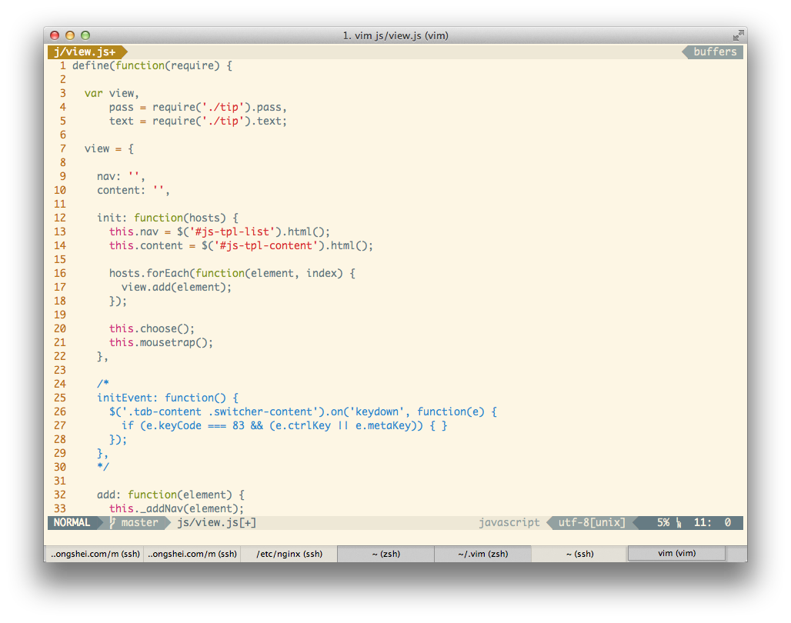

VIM
===

This is my VIM configuration. You can have a try by running the installation command.

### INSTALLATION

```
curl "https://raw.github.com/Witcher42/vim/master/script.sh" | bash -s install
```

### UPDATE

```
curl "https://raw.github.com/Witcher42/vim/master/script.sh" | bash -s update
```

### Screen Shot

